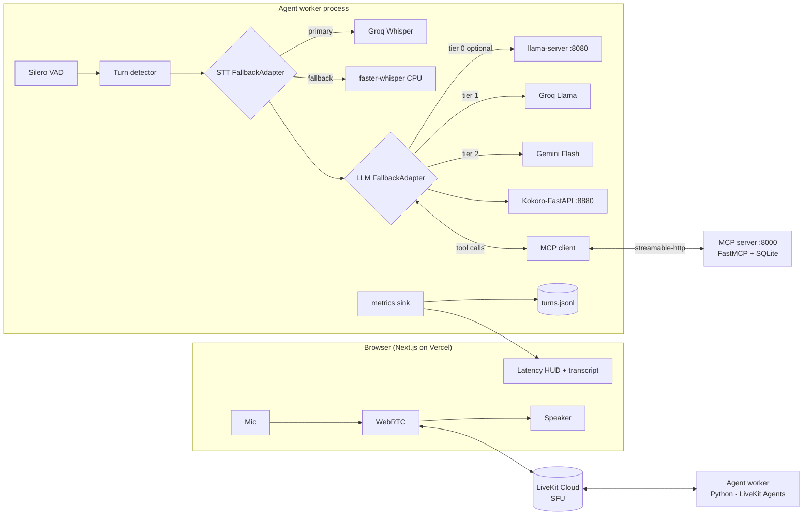

# SONAR — Real-Time Voice Agent (Build Plan)

> **Superseded in part.** The provider choices (STT, LLM, TTS) and the absence of telephony
> in this document were reopened on 2026-09-03. For anything to do with providers,
> telephony, hosting or build order, the authoritative document is
> [`docs/superpowers/specs/2026-09-03-sonar-voice-agent-design.md`](docs/superpowers/specs/2026-09-03-sonar-voice-agent-design.md).
> This file is kept for the domain model, the tool specifications and the metrics design,
> which are unchanged.

> **Purpose of this file.** This is a complete, decision-final build plan. It is meant to be handed to an autonomous coding agent (e.g. Claude Code) which should execute it top-to-bottom **without asking the human any questions**. Every choice that could be a question has already been decided in the "Decisions" table. Where an external API may have drifted since this plan was written, the instruction is: *check the installed library's docs/`--help`, adapt, and keep going — do not stop to ask.*

---

## 0. One-paragraph summary

SONAR is a real-time, interruptible voice agent that runs on a laptop with no GPU and costs $0 to build and host. A user opens a web page, presses "Start call", and talks to an AI front-desk assistant for a fictional solar-installation company ("Helios Solar"). The agent hears the user (Silero VAD + Groq Whisper STT, with a local faster-whisper fallback), thinks (Groq-hosted LLM, with Gemini fallback, and a pre-wired slot for a local llama.cpp model that Project 2 will fill), speaks (Kokoro TTS on CPU), and can be interrupted mid-sentence. It performs real actions through a custom MCP server (customer lookup, lead creation, site-visit booking, FAQ search). Every turn is instrumented so we can publish a measured **latency budget per stage** (p50/p95) and a time-to-first-audio number. Audio transport is WebRTC via LiveKit; the agent framework is LiveKit Agents (Python).

Resume outcome: a hosted demo URL anyone can talk to, a public repo, and a README with an architecture diagram and a real latency table.

---

## 1. Decisions (final — do not re-open)

| Topic | Decision | Why |
|---|---|---|
| Agent framework | **LiveKit Agents (Python) ≥ 1.2** | Industry-standard, built-in interruption handling, turn detection, per-stage metrics, native MCP support, fallback adapters |
| Audio transport | **LiveKit Cloud (free tier)** for both dev and public demo | Zero NAT/TURN pain on Windows/WSL2; same code works self-hosted later (Appendix A) |
| VAD | **Silero VAD** (`livekit-plugins-silero`) | Local, free, standard |
| Turn detection | **LiveKit `MultilingualModel` turn detector** (`livekit-plugins-turn-detector`) | Semantic end-of-utterance on CPU; strong interview talking point |
| STT primary | **Groq Whisper** `whisper-large-v3-turbo` via `livekit-plugins-groq` | Free tier, very fast |
| STT fallback | **faster-whisper `small`, int8, CPU** via a custom plugin (`agent/providers/local_whisper.py`) | Offline capable, demonstrates provider-agnostic design |
| LLM primary | **Groq**, model from env `GROQ_LLM_MODEL` (default `llama-3.3-70b-versatile`) | Free tier, fast TTFT, tool calling |
| LLM fallback | **Gemini Flash** through Gemini's OpenAI-compatible endpoint via `livekit-plugins-openai` | Free tier |
| LLM tier-3 (offline slot) | **llama.cpp `llama-server`** OpenAI-compatible at `http://localhost:8080/v1`, enabled by `LOCAL_LLM_ENABLED=1` | This is the seam Project 2 plugs into. Implement the config; model download is documented but optional in Project 1 |
| TTS | **Kokoro** via **Kokoro-FastAPI** Docker (CPU image), consumed with `livekit-plugins-openai` `openai.TTS(base_url=...)` | Best free CPU voice; OpenAI-compatible so no custom plugin; streaming supported |
| Tools | **Custom MCP server** (`mcp` Python SDK, FastMCP, streamable-HTTP) — 6 tools over SQLite | LiveKit consumes MCP servers natively |
| Domain | Front-desk assistant for fictional **Helios Solar** | Clear tools, relatable, aligns with the author's sales/CRM internship |
| Frontend | **Next.js 15 (App Router) + TypeScript + Tailwind + `@livekit/components-react`**, deployed on **Vercel** | Free, standard |
| Agent hosting (public demo) | **Hugging Face Space (Docker, free CPU)** for the worker; a **second HF Space** running Kokoro-FastAPI | Free; worker only needs outbound connectivity |
| Metrics | LiveKit `metrics_collected` events → JSONL per turn → `scripts/latency_report.py` (p50/p95) → also pushed to the browser over the LiveKit data channel for a live HUD | The "measured latency budget" deliverable |
| Language | Python 3.12 (`uv`), Node 20+ | — |
| Lint/test | `ruff`, `pytest`, GitHub Actions on push | Free for public repos |
| Repo name | `sonar` (single repo, three packages: `agent/`, `mcp-server/`, `web/`) | — |
| Licence | MIT | — |

**Explicitly rejected:** Pipecat (fine, but LiveKit has cleaner MCP + metrics + cloud free tier), Daily/Twilio (paid), ElevenLabs/OpenAI TTS (paid), Deepgram (paid after credits), noise-cancellation plugin (cloud-only feature, uncertain on free tier — skip).

---

## 2. Target machine and constraints

- Windows 11 laptop, AMD Ryzen 7 5825U (8 cores/16 threads), 16 GB RAM, **integrated GPU only (no CUDA)**, ~86 GB free disk.
- Everything must run on CPU. No paid services. No credit card.
- Development happens inside **WSL2 (Ubuntu 24.04)** with **Docker Desktop (WSL2 backend)**. The browser runs on Windows and reaches LiveKit Cloud over the internet, so no local port forwarding is needed for audio.
- Disk budget: Kokoro-FastAPI CPU image ~3–4 GB, faster-whisper `small` ~500 MB, Silero + turn-detector models < 500 MB, node_modules ~500 MB. Keep total under 8 GB.

---

## 3. Human prerequisites (the only manual steps — do these before starting the agent)

The coding agent cannot create accounts. The human does the following once and fills `.env` files. After this, the coding agent must not need anything else.

1. **WSL2 + Docker Desktop**: install Ubuntu 24.04 in WSL2, install Docker Desktop with WSL2 integration enabled. Free ≥ 40 GB disk on `C:`.
2. **Node 20+** inside WSL2 via `nvm`. **Python 3.12** available (`sudo apt install python3.12 python3.12-venv` if needed). Install `uv` (`pip install uv` or the official installer).
3. **Groq** account → API key. (`GROQ_API_KEY`)
4. **Google AI Studio** → Gemini API key. (`GEMINI_API_KEY`)
5. **LiveKit Cloud** account → create a project → copy `LIVEKIT_URL` (wss://…livekit.cloud), `LIVEKIT_API_KEY`, `LIVEKIT_API_SECRET`.
6. **GitHub** repo `sonar` (public). **Hugging Face** account + write token (`HF_TOKEN`). **Vercel** account linked to GitHub.
7. Create `agent/.env`, `mcp-server/.env`, `web/.env.local` from the `.env.example` files defined in §5 and paste the keys.

Everything else (installing packages, pulling Docker images, writing code, running tests, deploying) is done by the coding agent.

---

## 4. Architecture



**Per-turn latency budget (targets, measured at p50):**

| Stage | Metric (LiveKit metric field) | Target | Stretch |
|---|---|---|---|
| End-of-utterance detection | `EOUMetrics.end_of_utterance_delay` | ≤ 350 ms | ≤ 250 ms |
| STT (Groq) | `EOUMetrics.transcription_delay` | ≤ 400 ms | ≤ 300 ms |
| LLM time-to-first-token | `LLMMetrics.ttft` | ≤ 450 ms | ≤ 300 ms |
| TTS time-to-first-byte | `TTSMetrics.ttfb` | ≤ 300 ms | ≤ 200 ms |
| **Time-to-first-audio (sum)** | computed | **≤ 1.2 s** | **≤ 1.0 s** |

Time-to-first-audio (TTFA) per turn = `end_of_utterance_delay + llm.ttft + tts.ttfb` (transcription delay overlaps EOU in LiveKit's pipeline; report both the sum-based estimate and the raw fields).

---

## 5. Repository layout (create exactly this)

```
sonar/
├── README.md                     # filled progressively; final version per §9
├── PLAN.md                       # this file
├── LICENSE                       # MIT
├── .gitignore                    # python, node, .env*, *.jsonl in data/, models/
├── .github/workflows/ci.yml      # ruff + pytest for agent/ and mcp-server/; next build for web/
├── docker-compose.yml            # kokoro (and optional self-hosted livekit, see Appendix A)
├── Makefile                      # make setup | make kokoro | make mcp | make agent | make web | make report | make test
├── docs/
│   ├── architecture.md           # the mermaid diagram + prose
│   └── latency-budget.md         # generated table pasted here by scripts/latency_report.py --markdown
├── agent/
│   ├── pyproject.toml
│   ├── .env.example
│   ├── Dockerfile                # for the HF Space
│   ├── main.py                   # worker entrypoint (§6.3)
│   ├── config.py                 # env parsing + provider chain construction (§6.4)
│   ├── prompts.py                # system prompt (§6.6)
│   ├── providers/
│   │   ├── __init__.py
│   │   └── local_whisper.py      # faster-whisper STT plugin (§6.5)
│   ├── metrics_sink.py           # per-turn aggregation, JSONL + data-channel publish (§6.7)
│   ├── data/                     # turns.jsonl lands here (gitignored)
│   └── tests/
│       ├── test_config.py
│       ├── test_metrics_sink.py
│       └── test_local_whisper.py # runs on a bundled 2s wav fixture
├── mcp-server/
│   ├── pyproject.toml            # package name: sonar_tools  (Project 2 pip-installs this!)
│   ├── .env.example
│   ├── sonar_tools/
│   │   ├── __init__.py
│   │   ├── db.py                 # SQLite schema + connection
│   │   ├── seed.py               # deterministic seed data (Faker, seed=42)
│   │   ├── tools.py              # pure-Python tool functions (no MCP imports) — importable by Project 2
│   │   ├── server.py             # FastMCP wrapper exposing tools.py over streamable-http
│   │   └── kb/faq.json           # ~40 FAQ entries for Helios Solar
│   └── tests/test_tools.py
├── web/                          # Next.js 15 app
│   ├── app/page.tsx
│   ├── app/api/token/route.ts
│   ├── components/CallPanel.tsx
│   ├── components/LatencyHud.tsx
│   ├── components/Transcript.tsx
│   ├── lib/metrics.ts
│   ├── .env.example
│   └── package.json
└── scripts/
    ├── latency_report.py         # p50/p95 per stage from agent/data/turns.jsonl
    └── warm.py                   # hits Kokoro + MCP + LLM once so first user turn isn't cold
```

### `.env.example` files (copy verbatim, fill values)

`agent/.env.example`
```
LIVEKIT_URL=wss://YOUR-PROJECT.livekit.cloud
LIVEKIT_API_KEY=
LIVEKIT_API_SECRET=
GROQ_API_KEY=
GROQ_STT_MODEL=whisper-large-v3-turbo
GROQ_LLM_MODEL=llama-3.3-70b-versatile
GEMINI_API_KEY=
GEMINI_LLM_MODEL=gemini-2.5-flash
GEMINI_OPENAI_BASE_URL=https://generativelanguage.googleapis.com/v1beta/openai/
LOCAL_LLM_ENABLED=0
LOCAL_LLM_BASE_URL=http://localhost:8080/v1
LOCAL_LLM_MODEL=sonar-tune
KOKORO_BASE_URL=http://localhost:8880/v1
KOKORO_VOICE=af_heart
MCP_SERVER_URL=http://localhost:8000/mcp
LOCAL_WHISPER_MODEL=small
METRICS_JSONL=./data/turns.jsonl
LOG_LEVEL=INFO
WORKER_HTTP_PORT=8081
```

`mcp-server/.env.example`
```
MCP_HOST=0.0.0.0
MCP_PORT=8000
SONAR_DB_PATH=./sonar.db
```

`web/.env.example` (→ `.env.local`)
```
LIVEKIT_URL=wss://YOUR-PROJECT.livekit.cloud
LIVEKIT_API_KEY=
LIVEKIT_API_SECRET=
```

---

## 6. Component specifications

### 6.1 Docker services (`docker-compose.yml`)

```yaml
services:
  kokoro:
    image: ghcr.io/remsky/kokoro-fastapi-cpu:latest
    ports: ["8880:8880"]
    restart: unless-stopped
```
Verify: `curl -s http://localhost:8880/v1/audio/voices` lists voices including `af_heart`; `curl -X POST http://localhost:8880/v1/audio/speech -H 'content-type: application/json' -d '{"model":"kokoro","input":"Hello from Sonar","voice":"af_heart","response_format":"mp3"}' -o /tmp/t.mp3` produces a playable file.

If the image name has changed, search GitHub for "remsky Kokoro-FastAPI" and use the current CPU image tag. If Kokoro-FastAPI cannot be made to work within 1 hour of effort, fall back to **Piper** (`rhasspy/piper` HTTP server, voice `en_US-lessac-medium`) behind a tiny FastAPI shim that exposes an OpenAI-compatible `/v1/audio/speech` returning PCM; keep the agent code unchanged.

### 6.2 MCP server (`mcp-server/`)

- Package `sonar_tools`, `pyproject.toml` with deps: `mcp>=1.10`, `rank-bm25`, `faker`, `python-dotenv`, `pydantic>=2`. Must be pip-installable from git (`pip install "git+https://github.com/<user>/sonar.git#subdirectory=mcp-server"`), because Project 2 imports `sonar_tools.tools` to validate training data.
- **`db.py`**: SQLite at `SONAR_DB_PATH`. Tables:
  - `customers(id, name, email UNIQUE, phone, city, plan TEXT CHECK(plan IN ('none','residential-5kw','residential-8kw','commercial')), created_at)`
  - `leads(id, name, email, company, interest, created_at)`
  - `site_visits(id, customer_email, start_iso, end_iso, title, created_at)` with a UNIQUE index on `(start_iso)` for simplicity (one crew).
- **`seed.py`**: idempotent; `Faker(seed=42)`; 60 customers (Indian names/cities, emails deterministic), 5 pre-booked site visits in the next 7 days. Run via `python -m sonar_tools.seed`.
- **`kb/faq.json`**: ≥ 40 entries `{ "q": ..., "a": ... }` about Helios Solar: pricing per kW (e.g. ₹65,000–75,000 per kW residential), subsidy (PM Surya Ghar scheme facts phrased generically), warranty (25-year panel, 10-year inverter), installation timeline (2–3 weeks after site visit), net metering, maintenance, financing, service areas (Hyderabad, Warangal, Vijayawada, Bengaluru). Write these yourself; they are fiction for a demo.
- **`tools.py`** — plain functions with full type hints and docstrings (the docstrings become the tool descriptions the LLM sees, so write them precisely):

```python
def get_current_datetime(timezone: str = "Asia/Kolkata") -> dict:
    """Return the current date, time and weekday in the given IANA timezone."""
def lookup_customer(query: str) -> dict:
    """Find an existing customer by email, phone, or (partial) name. Returns {found: bool, customers: [...]} with at most 5 matches."""
def create_lead(name: str, email: str, interest: str, company: str = "") -> dict:
    """Create a new sales lead. interest must be one of: residential, commercial, battery, unsure. Returns the created lead with id."""
def check_availability(date: str, duration_minutes: int = 60) -> dict:
    """List free site-visit slots (ISO 8601 start times, IST) on a date given as YYYY-MM-DD, between 09:00 and 17:00, excluding existing bookings."""
def book_site_visit(customer_email: str, start_iso: str, duration_minutes: int = 60, title: str = "Solar site assessment") -> dict:
    """Book a site visit for an existing customer at start_iso (ISO 8601, IST). Fails with {ok: false, reason} if the customer is unknown or the slot conflicts."""
def search_knowledge_base(question: str, top_k: int = 3) -> dict:
    """Search Helios Solar's FAQ (pricing, subsidy, warranty, timelines, service areas). Returns the top_k most relevant Q&A pairs with scores."""
```
  All functions return JSON-serialisable dicts, never raise for user errors (return `{"ok": false, "reason": "..."}`), validate inputs with pydantic.
- **`server.py`**:
```python
from mcp.server.fastmcp import FastMCP
from . import tools
mcp = FastMCP("sonar-tools", host=os.getenv("MCP_HOST","0.0.0.0"), port=int(os.getenv("MCP_PORT","8000")), stateless_http=True)
for fn in (tools.get_current_datetime, tools.lookup_customer, tools.create_lead, tools.check_availability, tools.book_site_visit, tools.search_knowledge_base):
    mcp.tool()(fn)
if __name__ == "__main__":
    mcp.run(transport="streamable-http")   # served at http://host:port/mcp
```
- **Tests** (`tests/test_tools.py`): seed into a temp DB; assert lookup by email/phone/partial name; lead validation errors; availability excludes seeded bookings; booking conflict returns `ok:false`; KB search returns the warranty entry for "how long is the panel warranty".
- Verify server: `python -m sonar_tools.server` then use the `mcp` Python client (`streamablehttp_client`) in a tiny script to `list_tools()` and call `search_knowledge_base`.

### 6.3 Agent worker (`agent/main.py`)

Install: `uv venv && uv pip install "livekit-agents[groq,openai,silero,turn-detector,mcp]>=1.2,<2" faster-whisper numpy python-dotenv` (plus dev: `pytest pytest-asyncio ruff`). Then **`python main.py download-files`** (fetches Silero + turn-detector weights; must be run in the Dockerfile too).

Reference implementation (adapt to the installed version's API if names differ — check `python -c "import livekit.agents, inspect; ..."` or the docs, do not guess):

```python
import logging, os
from dotenv import load_dotenv
from livekit.agents import (Agent, AgentSession, JobContext, JobProcess, WorkerOptions,
                            RoomInputOptions, MetricsCollectedEvent, cli, mcp, metrics)
from livekit.plugins import silero
from livekit.plugins.turn_detector.multilingual import MultilingualModel
from config import build_stt, build_llm, build_tts, settings
from metrics_sink import MetricsSink
from prompts import SYSTEM_PROMPT, GREETING_INSTRUCTIONS

load_dotenv()
log = logging.getLogger("sonar")

def prewarm(proc: JobProcess):
    proc.userdata["vad"] = silero.VAD.load()

class HeliosAgent(Agent):
    def __init__(self):
        super().__init__(instructions=SYSTEM_PROMPT)

async def entrypoint(ctx: JobContext):
    await ctx.connect()
    vad = ctx.proc.userdata["vad"]
    session = AgentSession(
        vad=vad,
        stt=build_stt(vad),
        llm=build_llm(),
        tts=build_tts(),
        turn_detection=MultilingualModel(),
        allow_interruptions=True,
        min_interruption_duration=0.5,
        min_endpointing_delay=0.4,
        max_endpointing_delay=3.0,
        mcp_servers=[mcp.MCPServerHTTP(url=settings.mcp_server_url)],
    )
    sink = MetricsSink(room=ctx.room, jsonl_path=settings.metrics_jsonl)

    @session.on("metrics_collected")
    def _on_metrics(ev: MetricsCollectedEvent):
        metrics.log_metrics(ev.metrics)
        sink.ingest(ev.metrics)          # sink schedules async publish itself

    await session.start(room=ctx.room, agent=HeliosAgent(), room_input_options=RoomInputOptions())
    await session.generate_reply(instructions=GREETING_INSTRUCTIONS)

if __name__ == "__main__":
    cli.run_app(WorkerOptions(entrypoint_fnc=entrypoint, prewarm_fnc=prewarm,
                              port=int(os.getenv("WORKER_HTTP_PORT", "8081"))))
```
Run locally: `python main.py dev` (auto-joins every new room in the LiveKit project — this is "automatic dispatch"; do not set `agent_name`).

### 6.4 Provider chains (`agent/config.py`)

```python
from livekit.agents import stt, llm, tts
from livekit.plugins import groq, openai
from providers.local_whisper import LocalWhisperSTT

def build_stt(vad):
    primary = groq.STT(model=settings.groq_stt_model, language="en")
    fallback = LocalWhisperSTT(model_size=settings.local_whisper_model)
    # Non-streaming STTs are wrapped by LiveKit with VAD-based segmentation automatically.
    return stt.FallbackAdapter([primary, fallback])   # check kwargs: vad=, attempt_timeout=

def build_llm():
    chain = []
    if settings.local_llm_enabled:
        chain.append(openai.LLM(model=settings.local_llm_model, base_url=settings.local_llm_base_url, api_key="local"))
    chain.append(groq.LLM(model=settings.groq_llm_model))
    chain.append(openai.LLM(model=settings.gemini_llm_model, base_url=settings.gemini_openai_base_url, api_key=settings.gemini_api_key))
    return llm.FallbackAdapter(chain)

def build_tts():
    return openai.TTS(model="kokoro", voice=settings.kokoro_voice, base_url=settings.kokoro_base_url, api_key="local")
```
`settings` is a pydantic-settings object reading the env vars from §5. `test_config.py` asserts chain length changes with `LOCAL_LLM_ENABLED`.

**Model-name drift rule:** before first run, the coding agent runs `curl https://api.groq.com/openai/v1/models -H "Authorization: Bearer $GROQ_API_KEY"` and, if `GROQ_LLM_MODEL` is not listed, picks the largest currently listed Llama instruct model that supports tools and writes it into `.env`. Same for Gemini (`GET {GEMINI_OPENAI_BASE_URL}models`). Log the choice in README §"Models used".

### 6.5 Local Whisper fallback plugin (`agent/providers/local_whisper.py`)

Subclass `livekit.agents.stt.STT` with `STTCapabilities(streaming=False, interim_results=False)`. Implement `_recognize_impl(buffer, *, language, conn_options)`:
1. `frame = rtc.combine_audio_frames(buffer)`; resample to 16 kHz mono (`frame.remix_and_resample(16000, 1)` or `rtc.AudioResampler`).
2. Convert int16 → float32 numpy in [-1, 1].
3. `segments, info = await asyncio.to_thread(self._model.transcribe, audio, language="en", beam_size=1, vad_filter=False)`.
4. Return `stt.SpeechEvent(type=SpeechEventType.FINAL_TRANSCRIPT, alternatives=[stt.SpeechData(language="en", text=text)])`.
Model: `WhisperModel("small", device="cpu", compute_type="int8", cpu_threads=8)` loaded lazily on first use. Test with a bundled 2-second WAV fixture saying "hello sonar" (generate it with Kokoro during setup and commit the WAV, ~60 KB).

### 6.6 Prompts (`agent/prompts.py`)

System prompt requirements (write it fully, ~200 words): identity ("Sonar, the voice assistant for Helios Solar"); speak in short sentences (voice — max 2 sentences per reply unless reading back a list); never invent prices/dates — always call `search_knowledge_base` for facts and `get_current_datetime` for "today/tomorrow"; confirm email spelling letter-by-letter before `create_lead`/`book_site_visit`; ask one clarifying question when a required tool argument is missing; never expose tool names; if interrupted, stop and listen. `GREETING_INSTRUCTIONS`: greet briefly, ask how you can help. (Project 2 reuses this exact prompt for training data, so keep it stable and export it.)

### 6.7 Metrics sink (`agent/metrics_sink.py`)

- Accepts `STTMetrics`, `LLMMetrics`, `TTSMetrics`, `EOUMetrics` (isinstance checks). Group by `speech_id` (LLM/TTS/EOU carry it; attach the latest STT metrics to the next speech_id).
- When a group has EOU+LLM+TTS, emit one turn record:
```json
{"ts": 1730000000.1, "speech_id": "...", "eou_delay_ms": 220, "transcription_delay_ms": 310,
 "llm_ttft_ms": 380, "llm_completion_tokens": 42, "llm_tokens_per_s": 95.2,
 "tts_ttfb_ms": 210, "tts_audio_duration_ms": 2400, "ttfa_estimate_ms": 810,
 "stt_provider": "groq|local", "llm_provider": "local|groq|gemini", "interrupted": false}
```
- Append to `METRICS_JSONL` and publish the same JSON on the room data channel: `await room.local_participant.publish_data(payload, reliable=True, topic="sonar.metrics")`.
- Provider attribution: read it from the FallbackAdapter's availability-changed events if exposed; otherwise record which chain index was active (wrap providers with a small label attribute). Do not spend >1 hour on attribution; fall back to "unknown".
- Unit-test the aggregation with fake metric objects.

### 6.8 Web app (`web/`)

- `npx create-next-app@latest web --ts --tailwind --app --eslint --src-dir=false --import-alias "@/*"`; add `livekit-client`, `@livekit/components-react`, `@livekit/components-styles`, `livekit-server-sdk`.
- `app/api/token/route.ts`: GET → creates `AccessToken(LIVEKIT_API_KEY, LIVEKIT_API_SECRET, {identity: "user-"+random, ttl: "15m"})`, grant `{roomJoin: true, room: "sonar-"+random, canPublish: true, canSubscribe: true}`, returns `{token, url: LIVEKIT_URL}`. Never expose the secret to the client.
- `app/page.tsx`: single-screen UI. Left: big "Start call"/"End call" button, `BarVisualizer` bound to the agent's audio track (`useVoiceAssistant`), agent state label (listening / thinking / speaking), mic mute. Right: `Transcript` (use `useTranscriptions` if present in the installed `@livekit/components-react`; else subscribe to `RoomEvent.TranscriptionReceived`) and `LatencyHud`.
- `LatencyHud.tsx`: listens to `RoomEvent.DataReceived` with topic `sonar.metrics`, decodes JSON, shows the last turn's EOU / STT / LLM TTFT / TTS TTFB / TTFA as horizontal bars against the §4 targets, plus a rolling p50 over the session. Show which provider served the turn.
- Use the `frontend-design` skill if available for visual polish; otherwise a clean dark UI. Must work on mobile Safari/Chrome (mic permission prompt on first tap).
- `RoomAudioRenderer` must be mounted or the user hears nothing.

### 6.9 Scripts

- `scripts/latency_report.py --jsonl agent/data/turns.jsonl [--markdown]`: prints a table with n, p50, p95, max for each stage and TTFA, split by `llm_provider`; `--markdown` writes `docs/latency-budget.md`. Uses only stdlib + `statistics`.
- `scripts/warm.py`: one Kokoro request, one MCP `list_tools`, one 5-token LLM request. Run before demos.

### 6.10 Makefile targets

`setup` (uv venv + installs + download-files + npm i + seed DB), `kokoro` (docker compose up -d kokoro), `mcp` (run server), `agent` (python main.py dev), `web` (npm run dev), `test` (pytest both packages + `npm run build`), `report`, `warm`, `all-local` (uses `tmux` or `honcho`/`foreman` style Procfile to start kokoro+mcp+agent+web).

---

## 7. Build order (each stage ends with green tests and a commit)

| # | Stage | Done when |
|---|---|---|
| 1 | Repo skeleton, licence, CI, Makefile, `.env.example`s | `make test` passes on empty packages; CI green |
| 2 | MCP server + seed + tests | `test_tools.py` green; manual `list_tools` shows 6 tools |
| 3 | Kokoro up via compose; `warm.py` TTS check | mp3 generated |
| 4 | Agent worker with Groq STT/LLM + Kokoro, no fallbacks, no MCP | `python main.py dev` + LiveKit **Agents Playground** (`agents-playground.livekit.io`, log in with the same project) → you can talk to it |
| 5 | Add MCP tools + prompts | Ask "book a site visit for priya.sharma@… tomorrow at 10" → booking appears in SQLite |
| 6 | Fallback adapters + local whisper plugin | Set an invalid `GROQ_API_KEY` for STT only → transcription still works via faster-whisper (slower). Restore key |
| 7 | Metrics sink + JSONL + data channel | 10-turn conversation → `make report` prints a table with all stages populated |
| 8 | Web app + token route + HUD + transcript | Works from Windows Chrome and a phone on the same LiveKit project |
| 9 | Tuning pass: hit the §4 targets | p50 TTFA ≤ 1.2 s on ≥ 30 turns; document knobs changed (`min_endpointing_delay`, Kokoro voice/format, prompt length) |
| 10 | Deploy: web → Vercel; agent → HF Space; Kokoro → HF Space | Public URL works for a stranger on a phone |
| 11 | README, architecture doc, latency table, 60-second demo GIF/video link | §9 checklist complete |

Interruption test for stage 4/9: while the agent reads a long FAQ answer, say "stop" — audio must cut within ~300 ms and the agent must respond to the new utterance.

---

## 8. Deployment details

### 8.1 Agent worker → Hugging Face Space (Docker SDK, free CPU basic)

- `agent/Dockerfile`: `python:3.12-slim`, install `ffmpeg`, copy code, `uv pip install --system ...`, `RUN python main.py download-files`, `ENV WORKER_HTTP_PORT=7860`, `CMD ["python","main.py","start"]`. The worker's built-in HTTP health server on port 7860 satisfies the Space's port requirement; set `app_port: 7860` in the Space README front-matter.
- Space secrets: all `agent/.env` values. `KOKORO_BASE_URL` points at the Kokoro Space (`https://<user>-sonar-kokoro.hf.space/v1`), `MCP_SERVER_URL` → run the MCP server **inside the same container** as a second process (use a small `entrypoint.sh` that starts `python -m sonar_tools.server &` then the worker) to avoid a third Space. Bundle a pre-seeded `sonar.db`.
- Free Spaces sleep after ~48 h idle; the README tells visitors it may take ~1 min to wake, and `scripts/warm.py` is run before interviews.

### 8.2 Kokoro → second HF Space

Dockerfile: `FROM ghcr.io/remsky/kokoro-fastapi-cpu:latest` + `ENV PORT=7860` (or override CMD to bind 7860). `app_port: 7860`.

### 8.3 Web → Vercel

Import the GitHub repo, root directory `web/`, add the three env vars. Custom domain not needed.

### 8.4 Alternative: run the worker on the laptop

`python main.py start` on the laptop with the LiveKit Cloud project works for anyone hitting the Vercel page while the laptop is on. Document as "low-latency mode" (laptop is faster than the free Space CPU).

---

## 9. Definition of done (README checklist)

- [ ] Public demo URL (Vercel) + note on wake-up time
- [ ] 60-second screen recording with audio (Loom/YouTube unlisted) linked at top
- [ ] Architecture diagram (mermaid) and one paragraph per stage
- [ ] Latency budget table (targets vs measured p50/p95 over ≥ 50 turns) — from `make report`
- [ ] Section "Design decisions": why fallback adapters, why semantic turn detection, why MCP, why Kokoro on CPU, what was tuned to hit the budget
- [ ] Section "Running locally" (5 commands) and "Deploying"
- [ ] Section "What Project 2 changes" linking to the `sonar-tune` repo
- [ ] CI badge green; `ruff` clean; tests listed
- [ ] `docs/latency-budget.md` committed

**Resume bullet this earns (fill numbers from the report):**
*"Built an interruptible real-time voice agent (LiveKit Agents, WebRTC, Silero VAD, semantic turn detection, Groq Whisper/LLM with local faster-whisper and Gemini fallbacks, Kokoro TTS on CPU) with tool use over a custom MCP server; instrumented every stage and tuned to p50 time-to-first-audio of X ms (p95 Y ms) on a laptop with no GPU; $0 infrastructure."*

---

## 10. Conventions for the coding agent

- Never ask the human a question; consult the Decisions table, then the installed library's docs, then pick the most conservative option and note it in `docs/decisions-log.md`.
- Never commit secrets. `.env*` is gitignored; `.env.example` is committed.
- Python: `uv`, `ruff` (line-length 100), type hints, `pytest`. Node: strict TS, `npm run build` must pass.
- One commit per stage in §7 with message `stage N: <title>`.
- If a library API has changed vs. this plan, adapt the code, keep the behaviour, and record the adaptation in `docs/decisions-log.md`.
- Time-box any rabbit hole to 1 hour, then take the documented fallback.
- Keep total disk use for this project under 8 GB; prune Docker images you don't use.

---

## Appendix A — Self-hosted LiveKit (optional, only if LiveKit Cloud free tier becomes unavailable)

Add to `docker-compose.yml`:
```yaml
  livekit:
    image: livekit/livekit-server:latest
    command: --dev --bind 0.0.0.0
    network_mode: host      # requires Docker Desktop host networking (Settings → Resources → Network)
```
Dev credentials are `devkey` / `secret`; `LIVEKIT_URL=ws://localhost:7880`. If host networking is unavailable on Docker Desktop, run the `livekit-server` binary directly in WSL2 (`curl -sSL https://get.livekit.io | bash`) and enable WSL2 mirrored networking in `.wslconfig`. WebRTC through NAT for external users needs TURN — that is why Cloud is the default.

## Appendix B — Groq free-tier notes

Rate limits are per-model, per-minute and per-day. If you see HTTP 429, the STT/LLM FallbackAdapters take over automatically; for load tests use the local tiers. Do not create multiple accounts.
